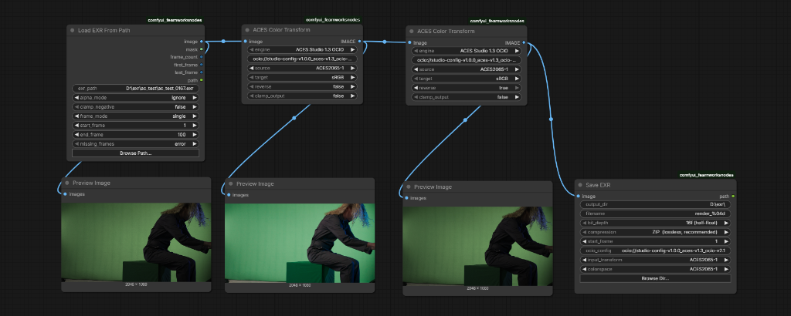

# ComfyUI ACES EXR Toolkit

Professional ACES and EXR workflow nodes for ComfyUI.

This extension adds practical OpenEXR loading/saving, ACES Studio 1.3 OCIO color transforms, alpha-aware previews, and simple HDR tone mapping for image pipelines that need float EXR support.

## Features

- **Multi-Layer EXR Export**: Save multi-channel EXRs containing beauty, depth, normal, mask, diffuse, specular, and emission passes into a single file for Nuke/Resolve VFX workflows.
- **EXR Layer & Metadata Inspection**: Extract named channels/layers from multi-layer EXRs, and read complete header metadata JSON.
- **Advanced Tone Mapping**: Includes **AgX** (Blender standard), **Filmic**, **DaVinci**, ACES fitted, and Reinhard curves.
- **Fast OCIO Processing**: Native bulk-pixel processing via PyOpenColorIO for lightning-fast ACES transformations.
- **Load EXR Sequences**: Auto-detects and loads numbered EXR sequences (`render.0001.exr`) directly into ComfyUI batch tensors.
- **16-bit & 32-bit Export**: Save half-float (16f) or float (32f) EXRs with standard compression codecs (ZIP, PIZ, DWAA) via `OpenEXR`.
- **HDR WebGL Viewer**: A GPU-accelerated viewer with real-time Exposure, Gamma, False Color (ARRI-style), and Channel isolation for true 32-bit float inspection inside ComfyUI.
- **HDR Generation Tools**: Includes Synthetic Highlight Expansion to generate HDR from SDR AI outputs, and Exposure Bracket Merging.
- **Path Security Containment**: Full containment protecting against path traversal, while supporting custom render drives configured via `extra_model_paths.yaml`.

## Nodes

| Node | Purpose |
| --- | --- |
| `Load EXR` | Load `.exr` files from ComfyUI `input`, with optional path override |
| `Load EXR From Path` | Load an EXR sequence from any allowed path or drive |
| `Load EXR Layer` | Extract specific named layers (beauty, depth, normal, mask, etc.) from multi-layer EXRs |
| `EXR Metadata Reader` | Inspect EXR header attributes, dimensions, channels, and compression |
| `ACES Color Transform` | Transform between ACES, camera, sRGB, and utility color spaces |
| `ACES Tone Map` | Tone map HDR float tensors with **AgX**, **Filmic**, **DaVinci**, ACES fitted, or Reinhard curves |
| `Save EXR (Multi-Layer)` | Save float EXRs with optional multi-layer passes (depth, normal, mask, diffuse, etc.) |
| `Nodex HDR Viewer 🎨` | GPU-accelerated (WebGL) 32-bit float viewer with Exposure, Gamma, False Color, and sRGB toggles |
| `Synthetic HDR Expansion 🚀` | Reconstructs a scene-linear HDR tensor from a standard display-referred (SDR) AI generation |
| `Exposure Bracket Merge 📸` | Merges a batch of SDR images at varying EV values into a single 32-bit HDR tensor |
| `HDR Exposure Adjust 💡` | Mathematically adjusts exposure by multiplying tensor RGB values by 2.0 ^ EV |

Nodes appear under:

```text
image/ACES + EXR
```

## Installation

Clone this repository into your ComfyUI `custom_nodes` folder:

```powershell
cd D:\Ai\ComfyUI_windows_portable\ComfyUI\custom_nodes
git clone https://github.com/azhagurajpandians/ComfyUI-ACES-EXR-Toolkit.git
```

Install the optional OpenColorIO dependency into the Python environment used by ComfyUI:

```powershell
D:\Ai\ComfyUI_windows_portable\python_embeded\python.exe -m pip install -r D:\Ai\ComfyUI_windows_portable\ComfyUI\custom_nodes\ComfyUI-ACES-EXR-Toolkit\requirements.txt
```

Restart ComfyUI after installation.

## Dependencies

Required runtime packages are normally already included with ComfyUI:

- `numpy`
- `torch`
- `opencv-python` or `opencv-python-headless`

Recommended for ACES Studio 1.3:

- `opencolorio` (The pip package is named `opencolorio`; the Python module it provides is `PyOpenColorIO`.)

Recommended for 16-bit Float and Compression export:

- `openexr`

## ACES Studio 1.3

The default OCIO config is:

```text
ocio://studio-config-v1.0.0_aces-v1.3_ocio-v2.1
```

That is the OpenColorIO built-in URI for:

```text
studio-config-v1.0.0_aces-v1.3_ocio-v2.1.ocio
```

Use `ACES Color Transform` with:

- `engine`: `ACES Studio 1.3 OCIO`
- `ocio_config`: `ocio://studio-config-v1.0.0_aces-v1.3_ocio-v2.1`
- `source`: the source color space, for example `ACEScg`
- `target`: the target color space, for example `sRGB` or `Utility - Linear - sRGB`

You can also point `ocio_config` to a local `.ocio` file, or set the `OCIO` environment variable.

## Loading EXR Files

For most EXR work, use `Load EXR From Path` and paste the absolute file path:

```text
D:\shots\render\beauty.exr
```

For ComfyUI input-folder workflows, copy EXRs into:

```text
ComfyUI\input
```

Then restart or refresh ComfyUI and use `Load EXR`.

## Alpha Preview

ComfyUI `Preview Image` does not display the separate mask output as transparency. For RGBA EXRs, choose an alpha mode that composites RGB for preview:

- `composite checker`
- `composite black`
- `composite gray`
- `composite white`

The alpha is still exposed separately as the `MASK` output.

## Common Workflows

### Preview an ACEScg EXR

```text
Load EXR From Path -> ACES Color Transform -> Preview Image
```

Recommended transform:

- `source`: `ACEScg`
- `target`: `sRGB`
- `clamp_output`: `true`

If the image is still too bright, insert `ACES Tone Map` before `Preview Image`.

### Convert Linear sRGB EXR to Display sRGB

```text
Load EXR From Path -> ACES Color Transform -> Preview Image
```

Recommended transform:

- `source`: `Linear sRGB`
- `target`: `sRGB`
- `clamp_output`: `true`

This will automatically reverse the color space before writing the final `.exr` file.

The output is written to your selected output directory or ComfyUI's `output` folder as a 16-bit or 32-bit float EXR.

### Nodex HDR Workflow (Synthetic HDR)

If you are generating standard `[0,1]` AI images (e.g., FLUX or SDXL) and want true High Dynamic Range lighting for post-processing or 3D environment maps:

```text
AI Generator -> Synthetic HDR Expansion 🚀 -> Nodex HDR Viewer 🎨 -> Save EXR
```

1. Route your SDR image into **Synthetic HDR Expansion 🚀** to mathematically reconstruct lost highlights without multi-prompt ghosting.
2. Plug the output into the **Nodex HDR Viewer 🎨** to visually inspect the true dynamic range. Try dropping the EV slider or enabling **False Color** to see the reconstructed highlight data roll off naturally instead of clamping to flat gray!
3. Save the result as a 32-bit `.exr` using **Save EXR**.

### Verified Round-trip Workflow

For professional VFX work, you often need to go `ACES -> sRGB -> ACES`. This toolkit provides a dedicated **reverse** toggle to make this setup easy and accurate.



**Key settings for a perfect round-trip:**
1. **Node 2 (Forward):** `source: ACES2065-1`, `target: sRGB`, `clamp_output: false`.
2. **Node 3 (Backward):** `source: ACES2065-1`, `target: sRGB`, **`reverse: true`**, `clamp_output: false`.
3. **IMPORTANT:** Always set `clamp_output` to **false** on intermediate nodes to preserve high-dynamic-range data for the reverse transform.

## Troubleshooting

### EXR does not show in file picker

Use `Load EXR From Path`. ComfyUI's upload widget is image-centric and can be unreliable for `.exr`.

### Preview is white

Your EXR likely has transparency and white RGB in transparent pixels. Set `alpha_mode` to `composite checker` or `composite black`.

### OCIO mode fails

Install OpenColorIO:

```powershell
python -m pip install opencolorio
```

For portable ComfyUI, use its embedded Python:

```powershell
D:\Ai\ComfyUI_windows_portable\python_embeded\python.exe -m pip install opencolorio
```

### Built-in matrix mode limitations

`Built-in matrices` supports only:

- `sRGB`
- `Linear sRGB`
- `ACEScg`
- `ACES2065-1`

Use `ACES Studio 1.3 OCIO` for camera spaces and full ACES config transforms.

## License

MIT License. See [LICENSE](LICENSE).
